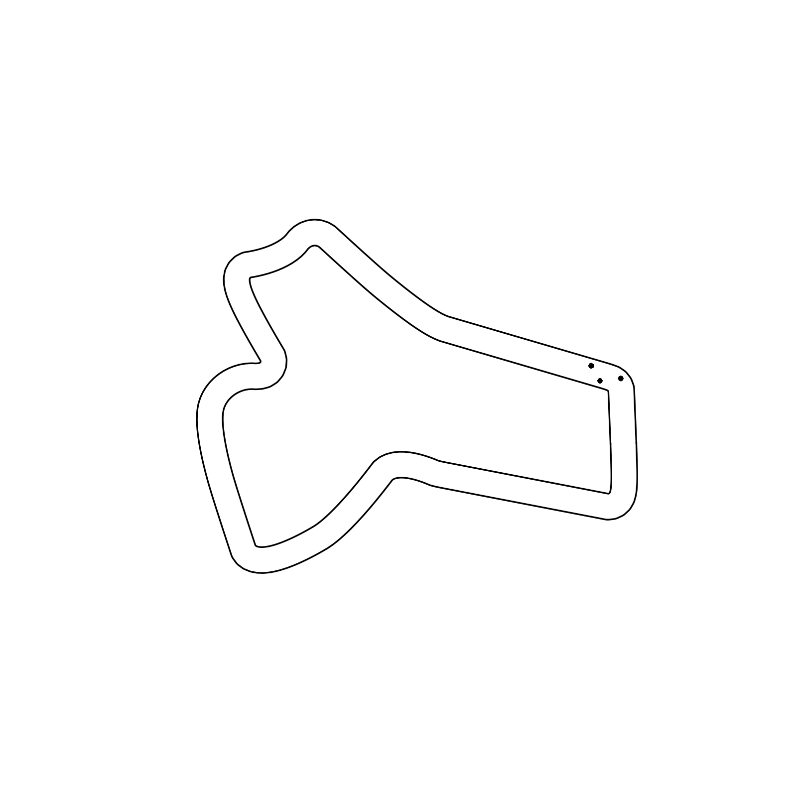

------------

The environment uses a convention that is similar to the ROS map convention. A map for the environment is created by two files: a ``yaml`` file containing the metadata of the map, and a single channel black and white image that represents the map, where black pixels are obstacles and white pixels are free space.

Map Metadata File (yaml)
~~~~~~~~~~~~~~~~~~~~~~~~~~

Only the ``resolution`` and the ``origin`` fields in the yaml files are used by the environment, and only the first two coordinates in the ``origin`` field are used. The unit of the resolution is *m/pixel*. The x and y (first two) numbers in the origin field are used to determine where the origin of the map frame is. Note that these two numbers follow the ROS convention. They represent the **bottom left** corner of the map image's coordinate in the world.

Map Image File
~~~~~~~~~~~~~~~~~~~~~~~~~~

A black and white, single channel image is used to represent free space and obstacles. For example, the Vegas map looks like this:

.. image:: ../gym/f110_gym/envs/maps/vegas.png
    :width: 300
    :align: center

Using a Custom Map
~~~~~~~~~~~~~~~~~~~~~~~~~~

The environment can be instantiated with arguments for a custom map. First, you can place your custom map files (.yaml and the image file) in the same directory, for example ``/your/path/to/map.yaml`` and ``/your/path/to/map.png``. Then you can create the environment with the absolute path to these files like this:

.. code:: python

    env = gym.make('f110_gym:f110-v0',
                   map='/your/path/to/map',
                   map_ext='.png')

The ``map`` argument takes the absolute path to the map files **without** any extensions, and the ``map_ext`` argument takes the extension to the map image file. **Note** that it is assumed that the two files are in the **same directory**, and have the **same filename** (not including the extensions, for example map.png and map.yaml)

Random Track Generator (Beta)
~~~~~~~~~~~~~~~~~~~~~~~~~~~~~~~~
A random track generator derived from the OpenAI CarRacing environment is also provided in ``gym/f110_gym/unittest/random_trackgen.py``. Note that it requires extra dependencies. ``OpenCV`` is required for image manipulation and IO operations, ``shapely`` and ``matplotlib`` are required for image generation. For OpenCV, you can follow the tutorial at https://docs.opencv.org/master/df/d65/tutorial_table_of_content_introduction.html for installation on different platforms. Then you can install ``shapely`` and ``matplotlib`` with: ``$ pip3 install shapely matplotlib``.

After you've installed the dependencies, you can run the track generator by:

.. code:: bash

    $ python3 random_trackgen.py --seed 12345 --num_maps 1

where the ``--seed`` argument (int, default 123) is for reproducibility, and the ``--num_maps`` argument is for the number of maps you want to generate. By default, the script will create two directories in ``unittest``: ``unittest/maps`` and ``unittest/centerline``. The former contains all the map metadata and map image files, and the latter contains a csv file of the (x, y) coordinates of the points on the centerline of the track.

An example of a randomly generated track:

Changing Parameters in Vehicle Dynamics
------------------------------------------

The vehicle dynamic model used in the environment is the Single-Track Model from https://gitlab.lrz.de/tum-cps/commonroad-vehicle-models/.

You can change the default paramters (identified on concrete floor with the default configuration F1TENTH vehicle) used in the environment in two ways.

